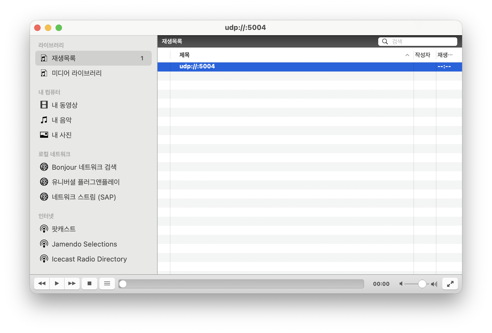

# Video Streamer 테스트 가이드

이 프로젝트는 `sample.mp4`와 `voice_sample.wav`를 네트워크 스트림으로 보내고, VLC에서 수신해 재생하는 테스트입니다.

## VLC 설정 방법 (자세한 단계)

1. **VLC 실행**
2. 상단 메뉴에서 **파일**을 클릭합니다.
3. **네트워크 열기**를 선택합니다.
4. **RTP/UDP 스트림 열기** 탭으로 이동합니다.
5. **UDP**를 선택합니다.
6. 전송 방식은 **유니캐스트**로 설정합니다.
7. **포트**에 `5004`를 입력합니다.
8. **열기** 버튼을 눌러 수신 대기 상태로 둡니다.

> 참고: 아래 스크린샷을 확인하세요.



## 스트림 전송 테스트 실행

VLC가 수신 대기 상태일 때 아래 명령을 실행합니다.

```bash
python test_sample_video.py
```

실행되면 `sample.mp4`의 영상과 `voice_sample.wav`의 오디오가 함께 전송됩니다.

## 문제 해결 팁

- 영상/음성이 안 나오면 **VLC가 먼저 열려 있는지** 확인하세요.
- 포트가 다르면 VLC와 전송 코드의 포트를 동일하게 맞춰야 합니다.
- 방화벽이 UDP를 막고 있으면 로컬호스트에서도 재생이 안 될 수 있습니다.

## Troubleshooting: 연속 전송 시 영상이 멈추는 문제

### PTS란?

PTS(Presentation Time Stamp)는 **디코더가 프레임을 언제 화면/스피커에 내보낼지**를 나타내는 타임스탬프입니다.  
VLC는 같은 포트로 들어오는 스트림을 **연속된 타임라인**으로 가정하기 때문에, 새 전송에서 PTS가 **뒤로 돌아가거나 0부터 다시 시작**되면 영상 갱신이 거의 되지 않는 문제가 발생할 수 있습니다.

### 문제 증상

- 첫 전송은 정상인데, **바로 다시 전송하면 영상이 거의 움직이지 않음**
- 오디오는 정상적으로 들림
- 일정 시간이 지난 뒤 다시 전송하면 정상 복귀

### 원인

새 전송이 시작될 때 **오디오/영상의 PTS가 이전 전송보다 작아지면서** FFmpeg 내부에서 `Queue input is backward in time` 경고가 발생했고,  
VLC가 이를 **이전 스트림의 연장으로 해석**해 영상 프레임을 제대로 갱신하지 못했습니다.

### 해결 방법

매 전송마다 **PTS를 앞으로 밀어주는 오프셋을 부여**해 타임라인이 항상 증가하도록 만들었습니다.

여기서 "앞으로 밀어주는 값"은 **프레임에 붙는 재생 시간표를 미래로 이동시키는 값**입니다.  
예를 들어 이전 전송의 마지막 시간이 120초라면, 새 전송의 첫 프레임 시간표를 120초보다 뒤쪽으로 시작하게 만들어 **"과거 시간"으로 돌아가지 않게** 합니다.

적용 코드 (`play_video_vlc.py`):

```python
pts_offset = time.time() % 10000

ffmpeg_cmd = [
    args.ffmpeg_path,
    "-fflags",
    "+genpts",
    "-itsoffset",
    f"{pts_offset:.3f}",
    "-f",
    "rawvideo",
    "-pix_fmt",
    "bgr24",
    "-video_size",
    f"{width}x{height}",
    "-framerate",
    str(fps),
    "-i",
    video_fifo,
]
if args.audio_path:
    ffmpeg_cmd += [
        "-itsoffset",
        f"{pts_offset:.3f}",
        "-f",
        "s16le",
        "-ar",
        str(audio_sample_rate),
        "-ac",
        str(audio_channels),
        "-i",
        audio_fifo,
    ]
```

이렇게 하면 VLC가 **새 전송을 새로운 타임라인**으로 인식해 영상이 즉시 정상 갱신됩니다.

### 왜 오디오는 정상처럼 들리나요?

영상과 음성은 **타임스탬프 불연속에 대한 민감도**가 다릅니다.

- 오디오는 작은 시간 역행/불연속이 있어도 **재생을 이어가려는 경향**이 큽니다.
- 영상은 키프레임과 프레임 순서 의존도가 높아, 타임라인이 꼬이면 **프레임이 대기/폐기**되어 화면이 멈춘 듯 보일 수 있습니다.
- VLC 내부에서도 **영상은 더 엄격하게 타임라인 정합성을 요구**하고, 오디오는 비교적 완화된 보정을 수행합니다.

## 동작 방식 요약 (자세히)

1. `test_sample_video.py`가 테스트에 필요한 경로를 만든 뒤 `play_video_vlc.py`를 실행합니다.
2. `play_video_vlc.py`가 `sample.mp4`를 OpenCV로 열고, 해상도와 FPS를 읽습니다.
3. `voice_sample.wav`는 `wave` 모듈로 열어 **샘플레이트/채널 수/16-bit PCM** 여부를 확인합니다.
4. 전송 대상은 `udp://{host}:{port}` 형식의 **MPEG-TS 스트림**이며, 기본 포트는 `5004`입니다.
5. 영상은 `--video-chunk-frames` 단위로 프레임을 묶어 **영상 큐에 적재**합니다.
6. 음성은 `--audio-chunk-frames` 단위로 샘플을 묶어 **음성 큐에 적재**합니다.
7. 메인 루프는 **PTS(타임스탬프)** 기준으로 영상/음성 큐에서 데이터를 꺼내 순서를 맞춥니다.
8. 영상은 `bgr24` 포맷으로 `VideoFrame`을 만들고, `libx264`로 인코딩합니다.
9. 음성은 `s16` 포맷으로 `AudioFrame`을 만들고, `aac`로 인코딩합니다.
10. 인코딩된 패킷을 `mpegts` 컨테이너에 **mux**한 뒤 UDP로 송출합니다.
11. VLC는 `udp://@:5004`에서 스트림을 받아 영상과 오디오를 재생합니다.

> 참고: 버퍼 크기나 청크 크기를 키우면 안정성은 올라가지만 지연이 늘어날 수 있습니다.
